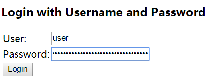

# Spring Security 初识（一）


接下来我用Spring Boot 快速搭建一个项目进行演示。只需要新建一个Controller即可：

```java
/**
 * @author itguang
 * @create 2017-12-28 9:44
 **/
@RestController
public class HelloController {

    @RequestMapping("hello")
    public String hello() {

        return "hello Spring Security";
    }
}
```

然后我们启动项目，访问 http://localhost/hello （注意这里我把启动端口修改为了80，文章最后会有源码地址，可供参考）

然后就会看到我们返回的 hello Spring Security 字符串。

下面我们添加Spring Security的依赖

```xml
<dependency>
    <groupId>org.springframework.boot</groupId>
    <artifactId>spring-boot-starter-security</artifactId>
</dependency>
```
开始进行安全相关的配置。


## 1,过滤web请求

```java
/**
 * @author itguang
 * @create 2017-12-28 9:16
 **/
public class SecurityWebInitializer extends AbstractSecurityWebApplicationInitializer {
}
```


## 2,编写简单的安全性配置,启用Spring Security

```java

/**
 * @author itguang
 * @create 2017-12-28 9:19
 **/
@Configuration
@EnableWebSecurity
public class SecurityConfig extends WebSecurityConfigurerAdapter{

}
```


接下来访问 : http://localhost/hello,页面会自动跳转到 http://localhost/login 让我们登陆.

奇怪我们并没有配置登陆页,怎么会让我们登陆呢?其实这就是 Spring Security 为我们做的安全验证,如下图:


用户名默认是user，密码我们需要在项目的启动日志中去查看，找到这一行 `Using default security password: 236f5782-6076-414e-b182-78ce138a8cc9`，
把密码填上去，注意每次启动的密码都不一样，是随机的。然后我们点击login，页面就跳转到了 http://localhost/hello 页面，并且显示出我们在controller里面返回的 `hello Spring Security`

上面两步我们就完成了最简单的Spring Security 相关配置，但是很可惜，这并不是我们想要的结果。

我们想要指定web安全相关的细节。这需要我们通过重载 WebSecurityConfigurerAdapter 中的一个或多个方法来实现。
我们就可以通过重载 WebSecurityConfigureAdapter 的三个 configure（） 方法，来配置web安全性的细节。这个过程会使用传递进来的饿参数设置行为。

* configure（WebSecurity） 通过重载，配置Spring Security的Filter链。

* configure（HttpSecurity） 通过重载，配置如何通过拦截器保护请求。

* configure（AuthenticationManagerBuiler） 通过重在配置user-detail 服务。

我们在回过头看看之前写的 SecurityConfig 类，并没有重写任何一个方法，这也就解释了为什么应用现在是被锁定的。我们可以查看 WebSecurityConfigurerAdapter 的源码：


```java
	protected void configure(HttpSecurity http) throws Exception {
		logger.debug("Using default configure(HttpSecurity). If subclassed this will potentially override subclass configure(HttpSecurity).");

		http
			.authorizeRequests()
				.anyRequest().authenticated()
				.and()
			.formLogin().and()
			.httpBasic();
	}
```

这个简单的默认配置指定了该如何保护HTTP请求，以及客户端认证
用户的方案。通过调用authorizeRequests()和
anyRequest().authenticated()就会要求所有进入应用的
HTTP请求都要进行认证。它也配置Spring Security支持基于表单的登
录以及HTTP Basic方式的认证。

我们把光标放在 formLogin 和 httpBasic 上，可以看到这两个注释如下：

  
```java
	   
//The configuration below demonstrates customizing the defaults.
	   @Configuration
	   @EnableWebSecurity
	   public class FormLoginSecurityConfig extends WebSecurityConfigurerAdapter {
	  
	   	@Override
	   	protected void configure(HttpSecurity http) throws Exception {
	   		http.authorizeRequests().antMatchers("/**").hasRole("USER").and().formLogin()
	   				.usernameParameter("username") // default is username
	   				.passwordParameter("password") // default is password
	   				.loginPage("/authentication/login") // default is /login with an HTTP get
	   				.failureUrl("/authentication/login?failed") // default is /login?error
	   				.loginProcessingUrl("/authentication/login/process"); // default is /login
	   																		// with an HTTP
	   																		// post
	   	}
	  
	   	@Override
	   	protected void configure(AuthenticationManagerBuilder auth) throws Exception {
	   		auth.inMemoryAuthentication().withUser("user").password("password").roles("USER");
	   	}
	   }
	   
```
可以看到，默认配置了没有授权时的登陆页面和鞥失败时的错误页面，这也告诉我们，如果想自定义登录页可以重载这个方法。


```java
   @Configuration
	   @EnableWebSecurity
	   public class HttpBasicSecurityConfig extends WebSecurityConfigurerAdapter {
	  
	   	@Override
	   	protected void configure(HttpSecurity http) throws Exception {
	   		http.authorizeRequests().antMatchers("/**").hasRole("USER").and().httpBasic();
	   	}
	  
	   	@Override
	   	protected void configure(AuthenticationManagerBuilder auth) throws Exception {
	   		auth.inMemoryAuthentication().withUser("user").password("password").roles("USER");
	   	}
}
```
上面这个注释的示例演示了如何为应用程序配置HTTP基本身份验证。默认的域是“Spring Security Application”，但是可以使用它进行自定义


因此：为了让让 Spring Security 满足我们自己的应用需求，还需要添加一点配置，具体来讲我们需要：

* 1 配置用户存储

* 2 指定哪些请求需要认证，哪些请求不需要认证，以及所需要的权限。

* 3 提供一个自定义的登陆页面，代替原来简单的登录页面

我们下节再展开叙述。


