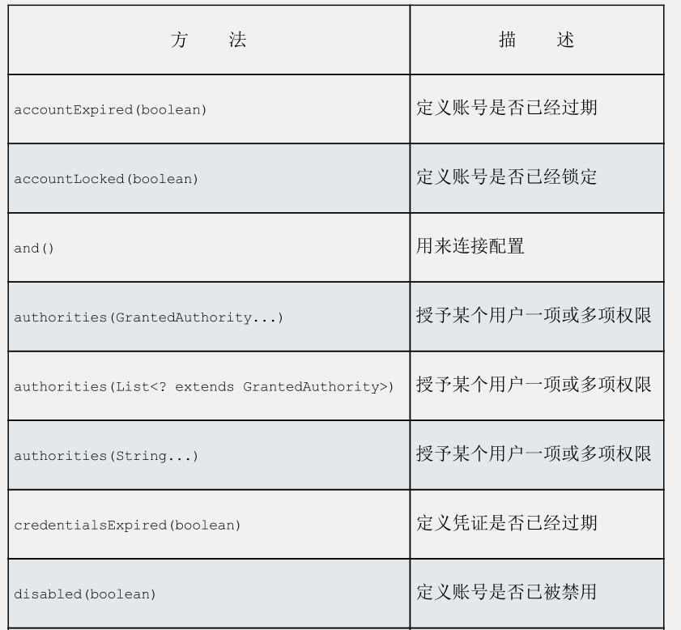
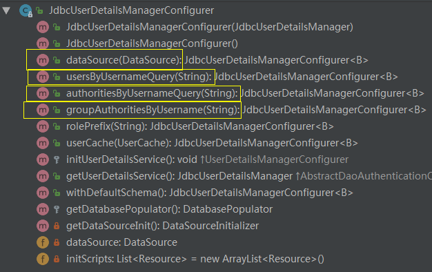
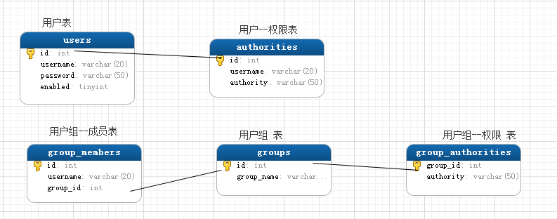
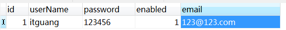
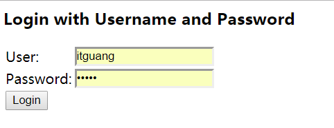
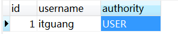

# Spring Security 初识（二）


本文我们接着[Spring Security 初识（一）](https://github.com/itguang/security/tree/master/spring-security-demo1)继续讲解上文留下的问题。

首先，我们看下如何在认证的过程中配置访问用户数据的服务。

针对上节演示的案例，我们需要改进的用户存储，也就是用户名、密码以及其他信息存储的地方，在进行认证决策的时候，会对其进行检索。而不是写死的用户名和随机的密码。

**Spring Security非常灵活，能够基于各种数据存储来认证用户。它内置了许多常见的用户存储场景。如： 内存，关系型数据库，以及LDAP。
当然，我们也可以编写并插入自定义的用户存储实现。**

借助Spring Security的Java配置，我们能够很容易地配置一个或多个数
据存储方案。那我们就从最简单的开始：在内存中维护用户存储。

## 1 使用基于内存的用户存储。

我们在上节的基础上进行改造，因为我们的安全配置类 SecurityConfig 扩展了 WebSecurityConfigurerAdapter ，因此配置用户存储最简单的方法就是 重载 configure（） 方法。

```java
/**
 * @author itguang
 * @create 2017-12-28 9:19
 **/
@Configuration
@EnableWebSecurity
public class SecurityConfig extends WebSecurityConfigurerAdapter{

    @Override
    public void configure(AuthenticationManagerBuilder auth) throws Exception {
        auth.inMemoryAuthentication()
                .withUser("itguang").password("123456").roles("USER").and()
                .withUser("admin").password("123456").roles("ADMIN");
    }
}
```

我们可以看到，configure方法中的 AuthenticationManagerBuilder 类型的参数，采用了构造者风格风格的接口来构建认证配置。
通过简单的调用 inMemoryAuthentication（） 就能启用基于内存的的用户存储。
通过 withUser 我们添加了两个基于内存存储的用户，并且分别授予的不同的角色。
withUser()方法返回的是 UserDetailsManagerConfigurer.UserDetailsBuilder ，这个对象提供了多个进一步配置用户的方法。

### 测试

接下来，就可以启动项目进行测试了。首先还是访问： http://localhost/hello ，会自动动跳转到 http://localhost/login 让我们去登陆。
这次我们就不用再去启动日志中找生成的随机密码了，我们用 上面配置的两个用户分别进行测试，发现都能够正确登陆，到这里一个简单的基于内存的用户存储就完成了。

**UserDetailsManagerConfigurer.UserDetailsBuilder除了password()、roles()和and()方法以外，还有其他的几个方法可以用来配置内存用户存储中的用户信息**

如下表所示：



但是通常来说，我们的系统肯定不止两个用户，基于内存的用户存储还是不能满足我们的要求，我们期待最好能将数据保存在某种关系型数据库中。

没错，Spring Security也为我们提供了基于关系型数据库的 用户存储。

## 2 使用基于数据的的用户存储

用户数据通常会存储在关系型数据库中并通过JDBC进行访问。为了配置Spring Security配置以JDBC为支撑的用户存储。我们可以使用jdbcAuthentication（）方法。

所需的最简单的配置如下所示：

```java
/**
 * @author itguang
 * @create 2017-12-28 9:19
 **/
@Configuration
@EnableWebSecurity
public class SecurityConfig extends WebSecurityConfigurerAdapter{

    @Autowired
    private DataSource dataSource;

    //基于数据库表的用户存储
    @Override
    public void configure(AuthenticationManagerBuilder auth) throws Exception {
        auth.jdbcAuthentication()
                .dataSource(dataSource);

    }

}
```

在这里我们只需要配置一个dataSource即可，这样就可以访问关系型数据库了。

其中 dataSource是通过自动装配的技巧得到的。在springboot下 dataSource 是自动装配的。
我们只需要引入如下依赖

```xml
<dependency>
			<groupId>org.springframework.boot</groupId>
			<artifactId>spring-boot-starter-jdbc</artifactId>
		</dependency>

		<dependency>
			<groupId>mysql</groupId>
			<artifactId>mysql-connector-java</artifactId>
			<scope>runtime</scope>
		</dependency>
```

并在appliciation.properties 中配置spring.datasource 相关属性即可。
```properties
spring.datasource.driverClassName=com.mysql.jdbc.Driver
spring.datasource.url=jdbc:mysql://localhost:3306/test?prepStmtCacheSize=517&cachePrepStmts=true&autoReconnect=true&characterEncoding=utf-8&allowMultiQueries=true
spring.datasource.username=root
spring.datasource.password=root
```
Spring Boot就会使用该配置创建一个DataSource。并装配为Spring的一个bean。因此我们可以直接使用 @Autowired 进行注入。

**好了，直到目前为止，对基于数据库的用户存储已经配置完毕，你可能回想，那既然基于数据库了，肯定要在数据库创建相应的表了。那表结构又是怎么样的呢？**

不要着急，接下来我们就开始数据库表结构的创建。

回到我们的 SpringSecurityConfig 的配置类，我们看下 jdbcAuthentication 的返回值是： JdbcUserDetailsManagerConfigurer，我们再看看 JdbcUserDetailsManagerConfigurer
类中还有哪些方法。



我们主要看下黄框表示出的几个方法，

```java
	/**
	 * Populates the {@link DataSource} to be used. This is the only required attribute.
	 *
	 * @param dataSource the {@link DataSource} to be used. Cannot be null.
	 * @return
	 * @throws Exception
	 */
	public JdbcUserDetailsManagerConfigurer<B> dataSource(DataSource dataSource)
			throws Exception {
		this.dataSource = dataSource;
		getUserDetailsService().setDataSource(dataSource);
		return this;
	}

	/**
	 * Sets the query to be used for finding a user by their username. For example:
	 *
	 * <code>
	 *     select username,password,enabled from users where username = ?
	 * </code>
	 * @param query The query to use for selecting the username, password, and if the user
	 * is enabled by username. Must contain a single parameter for the username.
	 * @return The {@link JdbcUserDetailsManagerConfigurer} used for additional
	 * customizations
	 * @throws Exception
	 */
	public JdbcUserDetailsManagerConfigurer<B> usersByUsernameQuery(String query)
			throws Exception {
		getUserDetailsService().setUsersByUsernameQuery(query);
		return this;
	}	
	/**
	 * Sets the query to be used for finding a user's authorities by their username. For
	 * example:
	 *
	 * <code>
	 *     select username,authority from authorities where username = ?
	 * </code>
	 *
	 * @param query The query to use for selecting the username, authority by username.
	 * Must contain a single parameter for the username.
	 * @return The {@link JdbcUserDetailsManagerConfigurer} used for additional
	 * customizations
	 * @throws Exception
	 */
	public JdbcUserDetailsManagerConfigurer<B> authoritiesByUsernameQuery(String query)
			throws Exception {
		getUserDetailsService().setAuthoritiesByUsernameQuery(query);
		return this;
	}
	/**
	 * An SQL statement to query user's group authorities given a username. For example:
	 *
	 * <code>
	 *     select
	 *         g.id, g.group_name, ga.authority
	 *     from
	 *         groups g, group_members gm, group_authorities ga
	 *     where
	 *         gm.username = ? and g.id = ga.group_id and g.id = gm.group_id
	 * </code>
	 *
	 * @param query The query to use for selecting the authorities by group. Must contain
	 * a single parameter for the username.
	 * @return The {@link JdbcUserDetailsManagerConfigurer} used for additional
	 * customizations
	 * @throws Exception
	 */
	public JdbcUserDetailsManagerConfigurer<B> groupAuthoritiesByUsername(String query)
			throws Exception {
		JdbcUserDetailsManager userDetailsService = getUserDetailsService();
		userDetailsService.setEnableGroups(true);
		userDetailsService.setGroupAuthoritiesByUsernameQuery(query);
		return this;
	}
```

通过查看源码以及方法上的注释，我们发现这三个方法主要是用来配置 用户查询（usersByUsernameQuery），权限查询（authoritiesByUsernameQuery），
权限组查询（groupAuthoritiesByUsername）的sql语句的。并且Spring已经给我们配置了默认的实现。

```java
 //默认的用户查询sql
    public static final String DEF_USERS_BY_USERNAME_QUERY = "select username,password,enabled "
            + "from users " + "where username = ?";
　　//默认的权限查询sql
    public static final String DEF_AUTHORITIES_BY_USERNAME_QUERY = "select username,authority "
            + "from authorities " + "where username = ?";
　　//默认的权限组查询sql
    public static final String DEF_GROUP_AUTHORITIES_BY_USERNAME_QUERY = "select g.id, g.group_name, ga.authority "
            + "from groups g, group_members gm, group_authorities ga "
            + "where gm.username = ? " + "and g.id = ga.group_id "
            + "and g.id = gm.group_id";
```

当然我们完全可以自定义这些语句。就像下面这样

```java
    @Autowired
    private DataSource dataSource;

    //基于数据库表的用户存储
    @Override
    public void configure(AuthenticationManagerBuilder auth) throws Exception {
        auth.jdbcAuthentication()
                .dataSource(dataSource)
                .usersByUsernameQuery("select username,password,enabled,email from users where username=?")
                .authoritiesByUsernameQuery("select username,authority from authorities where username = ?")
                .groupAuthoritiesByUsername("select g.id, g.group_name, ga.authority from groups g, group_members gm, group_authorities ga where gm.username = ? and g.id = ga.group_id and g.id = gm.group_id");


    }
```
接下来，就是按照我们定义的这些语句进行表结构的创建了。创建完之后，所有表模型如下图：



表结构创建语句如下：

```sql
DROP TABLE IF EXISTS `authorities`;
CREATE TABLE `authorities` (
  `id` int(11) NOT NULL AUTO_INCREMENT,
  `username` varchar(20) DEFAULT NULL,
  `authority` varchar(50) DEFAULT NULL,
  PRIMARY KEY (`id`)
) ENGINE=InnoDB AUTO_INCREMENT=2 DEFAULT CHARSET=utf8;

-- ----------------------------
-- Table structure for groups
-- ----------------------------
DROP TABLE IF EXISTS `groups`;
CREATE TABLE `groups` (
  `id` int(11) NOT NULL AUTO_INCREMENT,
  `group_name` varchar(50) DEFAULT NULL,
  PRIMARY KEY (`id`)
) ENGINE=InnoDB AUTO_INCREMENT=3 DEFAULT CHARSET=utf8;

-- ----------------------------
-- Table structure for group_authorities
-- ----------------------------
DROP TABLE IF EXISTS `group_authorities`;
CREATE TABLE `group_authorities` (
  `group_id` int(11) NOT NULL AUTO_INCREMENT,
  `authority` varchar(50) DEFAULT NULL,
  PRIMARY KEY (`group_id`)
) ENGINE=InnoDB AUTO_INCREMENT=2 DEFAULT CHARSET=utf8;

-- ----------------------------
-- Table structure for group_members
-- ----------------------------
DROP TABLE IF EXISTS `group_members`;
CREATE TABLE `group_members` (
  `id` int(11) NOT NULL AUTO_INCREMENT,
  `username` varchar(20) DEFAULT NULL,
  `group_id` int(11) DEFAULT NULL,
  PRIMARY KEY (`id`)
) ENGINE=InnoDB AUTO_INCREMENT=2 DEFAULT CHARSET=utf8;

-- ----------------------------
-- Table structure for users
-- ----------------------------
DROP TABLE IF EXISTS `users`;
CREATE TABLE `users` (
  `id` int(8) NOT NULL AUTO_INCREMENT,
  `username` varchar(20) DEFAULT NULL,
  `password` varchar(50) DEFAULT NULL,
  `enabled` tinyint(4) DEFAULT NULL,
  `email` varchar(50) DEFAULT NULL,
  PRIMARY KEY (`id`)
) ENGINE=InnoDB AUTO_INCREMENT=2 DEFAULT CHARSET=utf8;
```


### 测试：

现在，基于数据库的用户存储已经配置完毕，虽然看起来比基于内存的用户存储代码多，但仔细查看源码，还是不难理解的。

我们重新启动应用程序，浏览器访问： http://localhost/hello ，不出意外的有跳转到了 http://localhost/login 让我们进行登陆。但是现在我们的数据库中并没有用户。

所以我们还需要在数据库中创建用户，打开数据库，在users表中添加一个用户，如下：


我们填入我们新加入的用户名和密码，点击登录，就会发现，登陆失败：



可以看到错误信息为： Reason: Bad credentials

这是因为虽然我们只添加了用户，但是并没有为此用户分配权限，在 authoritiesByUsernameQuery 执行sql时查询到的就是null，就会返回 Bad credentials。

我们只需要在数据库的 authorities 表中为 itguang 用户添加一个权限即可。



再次登陆，就会发现已经可以登陆成功。


**对于最后一个 groupAuthoritiesByUsername 根据用户名查询用户组权限的sql，即使查询为null，只要是用户已经在 authorities 表中分配了权限，
就可以登陆成功。对于 权限--用户--角色（用户组） 的关系，不清楚的，可以去网上搜一下，有很多文章讲的很清楚。**


最后再补充一个小知识，看一下上面的认证查询，它会预期用户名密码存储在了数据库中。这里唯一的问题就是，如果使用明文存储密码，会带来安全性问题。
但是如果数据库中的密码进行转码的话，认证就会失败，因为它与用户提交的明文密码并不匹配。

为了解决这个问题，我们需要借助passwordEncoder()方法指定一个密码转码器（encoder）。

```java
    @Autowired
    private DataSource dataSource;

    //基于数据库表的用户存储
    @Override
    public void configure(AuthenticationManagerBuilder auth) throws Exception {
        auth.jdbcAuthentication()
                .dataSource(dataSource)
                .usersByUsernameQuery("select username,password,enabled,email from users where username=?")
                .authoritiesByUsernameQuery("select username,authority from authorities where username = ?")
                .groupAuthoritiesByUsername("select g.id, g.group_name, ga.authority from groups g, group_members gm, group_authorities ga where gm.username = ? and g.id = ga.group_id and g.id = gm.group_id")
                .passwordEncoder(new StandardPasswordEncoder("53cr3t"));


    }
```

passwordEncoder()方法可以接受Spring Security中PasswordEncoder接口的任意实现。
Spring Security的加密模块包括了三个这样的实现：BCryptPasswordEncoder、NoOpPasswordEncoder和StandardPasswordEncoder。


上述的代码中使用了StandardPasswordEncoder，采用的是 "SHA-256"算法加密实现。
 
 但是如果内置的实现无法满足需求时，你可以提供自定义的实现。
 
 ## 3 LDAP认证
 
 关于LDAP认证，这里不再详述，感兴趣的可以参考 《Spring In Action》 一书的 9.2.3节。
 
 
 **通过上面的讲解，我们已经熟悉了Spring Security 的几种认证方式，但是，实际开发中，我们的业务需求是千奇百怪的。
 免不了要我们自定义 用户存储，这我们放在下节再详细展开讲述。**


