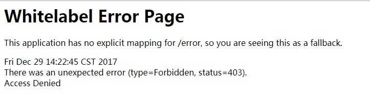

# Spring Security 初识（四）--请求拦截

在我们前面的文章[Spring Security 初识（一）](http://blog.csdn.net/itguangit/article/details/78923993)中,我们看到了一个最简单的
Spring Security 配置,会要求所有的请求都要经过认证.但是,这并不是我们想要的,我们通常想自定义应用的安全性.因为有些路径我们想要谁都可以访问.

Spring Security对此的实现也很简单.关键在于重载 WebSecurityConfigurerAdapter 的 configure() 方法.

我们使用最简单的基于内训的用户存储来演示Spring Security 的请求拦截,首先 就是 SecurotyConfigure 的实现.如下:

```java
/**
 * @author itguang
 * @create 2017-12-28 9:19
 **/
@Configuration
@EnableWebSecurity
public class SecurityConfig extends WebSecurityConfigurerAdapter {

    //基于内存的用户存储
    @Override
    public void configure(AuthenticationManagerBuilder auth) throws Exception {
        auth.inMemoryAuthentication()
                .withUser("itguang").password("123456").roles("USER").and()
                .withUser("admin").password("123456").roles("ADMIN");
    }

    //请求拦截
    @Override
    protected void configure(HttpSecurity http) throws Exception {
        http.authorizeRequests()
                .antMatchers("/shop/hello").authenticated()
                .antMatchers(HttpMethod.POST,"/shop/order").authenticated()
                .anyRequest().permitAll();
    }
}
```

先来 解释一下 configure(HttpSecurity http) 方法,在解释之前我们可以先看 WebSecurityConfigurerAdapter 里面的默认实现:

```java
/**
	 * Override this method to configure the {@link HttpSecurity}. Typically subclasses
	 * should not invoke this method by calling super as it may override their
	 * configuration. The default configuration is:
	 *
	 * <pre>
	 * http.authorizeRequests().anyRequest().authenticated().and().formLogin().and().httpBasic();
	 * </pre>
	 *
	 * @param http the {@link HttpSecurity} to modify
	 * @throws Exception if an error occurs
	 */
	// @formatter:off
	protected void configure(HttpSecurity http) throws Exception {
		logger.debug("Using default configure(HttpSecurity). If subclassed this will potentially override subclass configure(HttpSecurity).");

		http
			.authorizeRequests()
				.anyRequest().authenticated()
				.and()
			.formLogin().and()
			.httpBasic();
	}
```
默认的实现是什么意思呢? 通过之前我们的测试和查看源码,不难理解. HttpSecurity 实现了一个 HttpSecurityBuilder<HttpSecurity> 接口,这是一个构造器接口.

因此可以使用构造器典型的链式调用风格.通过调用authorizeRequests()和 anyRequest().authenticated()就会要求所有进入应用的 
HTTP请求都要进行认证。它也配置Spring Security支持基于表单的登录以及HTTP Basic方式的认证。


接下来再看看我们的实现: 我们只是配置了 "/shop/hello" 和 "/shop/order" 这两个路径必须进过认证,并且 "/shop/order" 必须是 post 请求的方式.对于其他的请求,
我们都是 .anyRequest().permitAll() ;都放行.

具体的controller请查看源码,文章最后会给出.

最后我们进行测试,会发现: 访问 "/shop/hello" 和"/shop/order" 浏览器会返回给我们一个空白页,如下图:



这是因为我们并没有配置未授权时的登录页面.

antMatchers()方法中设定的路径支持Ant风格的通配符。在这里我们并没有这样使用，但是也可以使用通配符来指定路径，如下所示:

```java
.antMatchers("/shop/**").authenticated();
```
我们也可以在一个对antMatchers()方法的调用中指定多个路径：

```java
.antMatchers("/shop/hello","/shop/order").authenticated();
```
antMatchers()方法所使用的路径可能会包括Ant风格的通配符，而regexMatchers()方法则能够接受正则表达式来定义请求路径。
例如，如下代码片段所使用的正则表达式与“/spitters/**”（Ant风格）功能是相同的：
```java
.regexMatchers().authenticated();
```
除了路径选择，我们还通过authenticated()和permitAll()来定义该如何保护路径。authenticated()要求在执行该请求时，
必须已经登录了应用。如果用户没有认证的话，Spring Security的Filter将会捕获该请求，并将用户重定向到应用的登录页面。
同时，permitAll()方法允许请求没有任何的安全限制。

除了authenticated()方法和permitAll()方法外,还有一些其他方法用来定义该如何保护请求.

* access(String)            如果给定的SpEL表达式计算结果为true，就允许访问
* anonymous()               允许匿名用户访问
* authenticated()           允许认证的用户进行访问
* denyAll()                 无条件拒绝所有访问
* fullyAuthenticated()      如果用户是完整认证的话（不是通过Remember-me功能认证的），就允许访问 
* hasAuthority(String)      如果用户具备给定权限的话就允许访问
* hasAnyAuthority(String...)如果用户具备给定权限中的某一个的话，就允许访问
* hasRole(String)           如果用户具备给定角色(用户组)的话,就允许访问/
* hasAnyRole(String...)     如果用户具有给定角色(用户组)中的一个的话,允许访问.
* hasIpAddress(String       如果请求来自给定ip地址的话,就允许访问.
* not()                     对其他访问结果求反.
* permitAll()               无条件允许访问
* rememberMe()              如果用户是通过Remember-me功能认证的，就允许访问

通过上面的方法,我们可以修改 configure 方法,要求用户不仅需要认证,还需要具备相应的权限

```java
  /**
     * 请求拦截
     * @param http
     * @throws Exception
     */
    @Override
    protected void configure(HttpSecurity http) throws Exception {
        http.authorizeRequests()
                .antMatchers("/hello").hasAnyAuthority("ROLE_DELETE")
                .antMatchers(HttpMethod.POST,"/order").hasAnyAuthority("ROLE_UPDATE")
                .anyRequest().permitAll();
    }
```

作为代替方案,我们还可以使用 hasRole() ,它会自动使用 "ROLE_" 前缀.

```java
  /**
     * 请求拦截
     * @param http
     * @throws Exception
     */
    @Override
    protected void configure(HttpSecurity http) throws Exception {
        http.authorizeRequests()
                .antMatchers("/hello").hasRole("DELETE")
                .antMatchers(HttpMethod.POST,"/order").hasRole("UPDATE")
                .anyRequest().permitAll();
    }
```

> 注意:这些规则会按照给定的顺序发挥作用。所以，很重要的一点就是将最为具体的请求路径放在前面，
而最不具体的路径（如anyRequest()）放在最后面。如果不这样做的话，那不具体的路径配置将会覆盖掉更为具体的路径配置。


## 使用Spring表达式进行安全保护

上面的方法中,我们看到一个 access() 方法,此方法可以接收一个Spel表达式让我们对请求进行拦截.

如下就是使用SpEL表达式来声明具有“HELLO”角色才能访问“/shop/hello”URL：

```java
.antMatchers("/shop/hello").access("hasRole('HELLO')");
```
这个对“/shop/hello”的安全限制与开始时的效果是等价的，只不过这里使用了SpEL来描述安全规则。
如果当前用户被授予了给定角色的话，那hasRole()表达式的计算结果就为true。

下面列出了Spring Security 支持的所有SPEL表达式:

* authentication 用户的认证对象
* denyAll           结果始终为false
* hasAnyRole(list of roles) 如果用户被授予了列表中任意的指定角色，结果为true
* hasRole(role) 如果用户被授予了指定的角色，结果为true
* hasIpAddress(IPAddress) 如果请求来自指定IP的话，结果为true
* isAnonymous() 如果当前用户为匿名用户，结果为true
* isAuthenticated()  如果当前用户进行了认证的话，结果为true
* isFullyAuthenticated() 如果当前用户进行了完整认证的话（不是通过Remember-me功能进行的认证），结果为true
* isRememberMe() 如果当前用户是通过Remember-me自动认证的，结果为true
* permitAll()  结果始终为true
* principal()  用户的principal对象


## 小结

这节我们讲了如何使用 HttpSecurity 进行细致的请求拦截,
此外,Spring Security 还支持防止跨站请求伪造（cross-site request forgery，CSRF,
和视图保护的功能,
这里就不再细讲,感兴趣的可以参考: spring in action 一书的 9.3.3 和 9.5 节.


