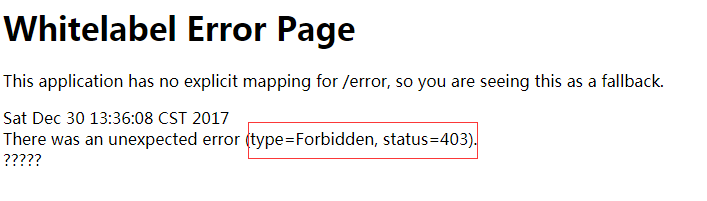

# Spring Security 初识（五）--保护方法应用


在Spring Securoty实现方法级别的安全性最常见的方法是使用特定的注解.将这些注解应用到需要保护的方法上.

Spring Security 提供了三种不同方式的安全注解.

* Spring 自带的 @Security 注解.
* JSR-250 的 @RolesAllow 注解.
* 表达式驱动的注解: @PreAythorize , @PostAuthorize ,@PreFilter , @PostFilter .

@Secured和@RolesAllowed方案非常类似，能够基于用户所授予的权限限制对方法的访问。
当我们需要在方法上定义更灵活的安全规则时，Spring Security提供了@PreAuthorize和@PostAuthorize，
而@PreFilter/@PostFilter能够过滤方法返回的以及传入方法的集合。

下面就开始介绍以上注解具体的使用方法.

## 使用@Secured注解限制方法调用

为了降低初学者的学识成本,我们使用最简单的使用内存的用户存储来演示.

```java
/**
 * @author itguang
 * @create 2017-12-28 9:19
 **/
@Configuration
@EnableWebSecurity
public class SecurityConfig extends WebSecurityConfigurerAdapter{

    //基于内存的用户存储
    @Override
    public void configure(AuthenticationManagerBuilder auth) throws Exception {
        auth.inMemoryAuthentication()
                .withUser("itguang").password("123456").roles("USER").and()
                .withUser("admin").password("123456").roles("ADMIN");
    }

}
```

在Spring中如果要启用基于注解的方法安全性,需要在配置类上使用@EnableGlobalMethodSecurity,如下所示:

```java
/**
 * @author itguang
 * @create 2017-12-30 10:44
 **/
@Configuration
@EnableGlobalMethodSecurity(securedEnabled = true)
public class MethodSecurityConfig extends GlobalMethodSecurityConfiguration {


}
```
除了@EnableGlobalMethodSecuroty注解外,我们注意到配置类还扩展了 GlobalMethodSecurotyConfiguration .
在前面的文章中我们介绍过 web安全的配置类扩展了 WebSecurityConfiguration ,与此类似,这个类能勾为方法级别的安全性提供精细的配置.

我们还可以看到 @EnableGlobalMethodSecuroty注解 的参数 securedEnabled 设置为了了true,这样的话Spring Security就会包装带有
@Secured 注解的方法,例如:
```java


    @RequestMapping("/admin")
    @Secured("ROLE_ADMIN")
    public String admin(){
        return "admin";
    }


```
由于方法上添加了 @Secured("ROLE_ADMIN") 注解,当我们浏览器访问 /admin 这个路径时,Spring就会执行 admin()方法,Spring Security的切面
就会判断当前用户是否有 `ROLE_ADMIN` 的权限.

看到这里你可能会有疑惑,为什么是 `ROLE_ADMIN` 呢,我们的SecurityConfigure 配置类中命名设置的是 `ADMIN` 啊.
`.withUser("admin").password("123456").roles("ADMIN");` ,其实这是Spring Security 自动为我们添加了 `ROLE_` 前缀,
如果我们要写成 `.withUser("admin").password("123456").roles("ADMIN");` 的话,Spring Security就会报错,

`java.lang.IllegalArgumentException: ROLE_ADMIN cannot start with ROLE_ (it is automatically added)` 

可以看到Spring Security 提醒我们这是自动添加的前缀,因此我们么有必要再添加 `ROLE_` 前缀.

但是,如果我们要为基于方法的拦截添加 @Secured 注解时,就必须添加 `ROLE_` 的前缀.比如: `@Secured("ROLE_ADMIN")` .

### 测试

这里只给出主要的代码,详细代码请参考源码,本文最后会给出.

按照上面的配置完毕,我们启动项目,访问 http://localhost/admin ,会提示让我们登陆,我们首先输入一个没有 `ROLE_ADMIN` 权限的用户,
用户名:itguang,密码:123456. 点击登陆,会发现浏览器返回下面的页面:



http状态码为 403,很明显就是无权限访问.接下来我们在用 admin 用户登陆,机会发现浏览器正确返回了 `admin` 字符串.


另外,@Secured会使用一个String数组作为参数,每个String值就是一个权限,调用这个方法的用户至少要具备其中一个权限.如下面示例:

```java
    @RequestMapping("/hello")
    @Secured({"ROLE_ADMIN","ROLE_USER"})
    public String hello() {

        return "hello Spring Security";

    }
```
itguang 和 admin 这两个用户都可以访问.如果方法被没有被认证的用户或者没有相应权限的用户访问,就会抛出一个Spring Security 异常.
（可能是AuthenticationException或AccessDeniedException的子类）,他们是非检查时异常,这个一场病最终必须被捕获或者处理.
如果被保护的方法是在web中被调用的,这个异常会被Spring Security 的过滤器自动处理.否则的话,你需要编写代码来处理这个异常.


## 在Spring Security中使用JSR-250的@RolesAllowed注解

@RolesAllowed注解和@Secured注解在各个方面基本上都是一致的。唯一显著的区别在于@RolesAllowed是JSR-250定义的Java标准注解.

如果选择使用@RolesAllowed的话，需要将@EnableGlobalMethodSecurity的jsr250Enabled属性设置为true，以开启此功能.

```java
/**
 * @author itguang
 * @create 2017-12-30 10:44
 **/
@Configuration
@EnableGlobalMethodSecurity(securedEnabled = true,jsr250Enabled = true)
public class MethodSecurityConfig extends GlobalMethodSecurityConfiguration {
    //基于内存的用户存储
    @Override
    public void configure(AuthenticationManagerBuilder auth) throws Exception {
        auth.inMemoryAuthentication()
                .withUser("itguang").password("123456").roles("USER").and()
                .withUser("admin").password("123456").roles("ADMIN");
    }
}
```

尽管我们这里只是启用了jsr250Enabled，但需要说明的一点是这与securedEnabled并不冲突。这两种注解风格可以同时启用.

如下:

```java
    @RequestMapping("/test1")
    @RolesAllowed("ROLE_ADMIN")
    public String test1(){
        return "test1";
    }
```

这两个注解都有一个不足之处,它们只能根据用户有没有授予特定的权限来限制方法的调用,在判断方式是否执行方面,无法使用其他的因素.
接下来，我们看一下如何组合使用SpEL与Spring Security所提供的方法调用前后注解，实现基于表达式的方法安全性.

## 使用表达式实现方法级别的安全性

Spring Security 3.0引入了几个新注解，它们使用SpEL能够在方法调用上实现更有意思的安全性约束。

* @PreAuthorize             :在方法调用之前，基于表达式的计算结果来限制对方法的访问
* @PostAuthorize            允许方法调用，但是如果表达式计算结果为false，将抛出一个安全性异常
* @PostFilter               允许方法调用，但必须按照表达式来过滤方法的结果
* @PreFilter                允许方法调用，但必须在进入方法之前过滤输入值

这些注解的参数都可接受一个SPEL 表达式.表达式可以是任意合法的SPEL表达式.

如果表达式的计算结果为true，那么安全规则通过，否则就会失败。安全规则通过或失败的结果会因为所使用注解的差异而有所不同。

我们需要将@EnableGlobalMethod-Security注解的 prePostEnabled 属性设置为true，从而启用它们：

```java

/**
 * @author itguang
 * @create 2017-12-30 10:44
 **/
@Configuration
@EnableGlobalMethodSecurity(securedEnabled = true,jsr250Enabled = true,prePostEnabled = true)
public class MethodSecurityConfig extends GlobalMethodSecurityConfiguration {
    //基于内存的用户存储
    @Override
    public void configure(AuthenticationManagerBuilder auth) throws Exception {
        auth.inMemoryAuthentication()
                .withUser("itguang").password("123456").roles("USER").and()
                .withUser("admin").password("123456").roles("ADMIN");
    }


}
```

现在方法调用前后的注解都已经启用了.

### @PreAuthorize和@PostAuthorize

@PreAuthorize和@PostAuthorize，它们能够基于表达式的计算结果来限制方法的访问。
在定义安全限制方面，表达式带了极大的灵活性。通过使用表达式，只要我们能够想象得到，就可以定义任意允许访问或不允许访问方法的条件。

@PreAuthorize和@PostAuthorize之间的关键区别在于表达式执行的时机。
@PreAuthorize的表达式会在方法调用之前执行，如果表达式的计算结果不为true的话，将会阻止方法执行。
与之相反，@PostAuthorize的表达式直到方法返回才会执行，然后决定是否抛出安全性的异常。

在方法调用之前验证权限,看下面的例子:

```java
/**
 * @author itguang
 * @create 2017-12-30 11:04
 **/
@RestController
public class UserController {

    @RequestMapping("/addUser")
    @PreAuthorize("hasRole('ROLE_USER') and #userEntity.password>8 or hasRole('ROLE_ADMIN')")
    public String addUser(UserEntity userEntity){
        return "addUser ok";
    }

}
```
这段代码是什么意思呢? 首先我们让访问 /addUser 的用户 必须是拥有 ROLE_USER 的用户,并且密码长度大于8,或者拥有 ROLE_ADMIN 权限的.
这如果如使用@Secured或者RoleAllowd 是实现不了的.而使用 @PreAuthorized 恰好能适用这些场景.
表达式中 #userEntity 直接使用了方法中的同名参数,这使得Spring Security 能够检查传入方法的参数.并将这些参数用于认证决策的指定.

在方法调用之后验证权限,看下面的例子:

```java
    @RequestMapping("/getUser/{username}")
    @PostAuthorize("returnObject.username == principal.username")
    public UserEntity getUser(@PathVariable(value = "username") String username) {

        //模拟从数据库中查找
        UserEntity userEntity = new UserEntity(username);

        return userEntity;
    }
```

启动项目,我们首先访问:http://localhost/getUser/itguang,会让我们登陆,我们用itguang 用户登陆,发现能够正确返回,
然后我们在此基础上再访问 http://localhost/getUser/admin ,就会返回http状态码403,禁止访问.说明配置生效.

下面我们来解释一下上面的代码,为了方便的访问受保护方法的返回对象,Spring Security 在SPEL中提供了名为 returnObject的返回变量.
在这里我们知道返回对象是一个UserEntity,所以可以直接 returnObject.username 取得里面的参数.
principal 是另一个Spring Security 内置的特殊变量,它代表了当前认证用户的主要信息,通常是用户名和权限列表.


### @PreAuthorize和@PostAuthorize---过滤方法的输入和输出

如果我们希望使用表达式来保护方法的话，那使用@PreAuthorize和@PostAuthorize是非常好的方案。但是，有时候限制方法调用太严格了。
有时，需要保护的并不是对方法的调用，需要保护的是传入方法的数据和方法返回的数据.

事后对方法的返回值进行过滤,如下:

```java
    @RequestMapping("getAll")
    @PreAuthorize("hasRole('ROLE_USER')")
    @PostFilter("filterObject.enabled == true")
    public List<UserEntity> getAllUser(){

        ArrayList<UserEntity> list = new ArrayList<>();
        list.add(new UserEntity("test1","123456",true));
        list.add(new UserEntity("test1","123456",false));

        return list;
    }
```
我们使用了 ` @PreAuthorize("hasRole('ROLE_USER')") @PostFilter("filterObject.enabled == true")` 这两个注解,
表明我们希望,用户必须拥有 `ROLE_USER` 权限,并且返回用户属性 enabled为true的所有用户.

表达式中的 filterObject 引用的是方法返回值List中的某一个元素,在这里是 UserEntity,并且过滤出 enabled为true的UserEntity,所以,
我们浏览器访问 http://localhost/getAll,并用itguang用户登录后,返回的只有一条用户的信息.

如果你觉得自己的安全表达式难以控制了，那么就应该看一下如何编
写自定义的许可计算器（permission evaluator），以简化你的SpEL表
达式。下面我们看一下如何编写自定义的许可计算器，用它来简化之
前用于过滤的表达式。

## 自定义许可计算器 PermissionEvaluator

使用 hasPermission 简化权限拦截中的SPEL表达式.

```java
   @RequestMapping("/delete")
    @PreAuthorize("ROLE_USER")
    @PreFilter("hasPermission(targetObject,'delete')")
    public String getAllUser(List<UserEntity> list){
            //从数据库中删除数据
            //...

        return "ok";
    }
```

上面代码实际上是在问一个问题,"当前用户有权限删除目标对象吗?" 如果有的话,表达式计算为true,该对象会被删除,

但是，hasPermission()是哪来的呢？它的意思是什么？更为重要
的是，它如何知道用户有没有权限删除targetObject所对应的
User？

hasPermission()函数是Spring Security为SpEL提供的扩展，它为开发者提供了一个时机，能够在执行计算的时候插入任意的逻辑。
我们所需要做的就是编写并注册一个自定义的许可计算器.

关于自定义 permissionEvalute ,可以参考 spring inaction 一书 14.2.2节.

## 小结

我们看到了六个可以在方法上声明安全性限制的注解。对于简单场景来说，面向权限的注解，包括Spring Security的@Secured以及基于标准的@RolesAllowed都很便利.
当安全规则更为复杂的时候，组合使用@PreAuthorize、@PostAuthorize以及SpEL能够发挥更强大的威力。我们还看到通过为@PreFilter和@PostFilter提供SpEL表达式，过滤方法的输入和输出。


