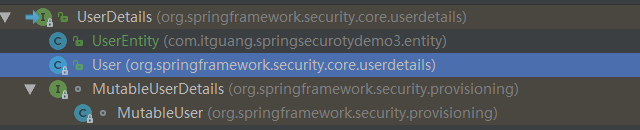

# Spring Security 初识（三）--配置自定义的用户存储

假设我们需要认证的用户存储在非关系型数据库中，如Mongo或
Neo4j，在这种情况下，我们需要提供一个自定义的
UserDetailsService接口实现。

上节我们讲到[Spring Security 初识（二）](http://blog.csdn.net/itguangit/article/details/78924032),我们在 SecurityConfig 的配置类中 重写了 configure(AuthenticationManagerBuilder auth) 方法,我们可以通过
AuthenticationManagerBuilder 这个构造器类使用不同的用户存储,如 inMemoryAuthentication()基于内存的,jdbcAuthentication()基于关系型数据库的.

通过查看AuthenticationManagerBuilder的源码可以发现里面还有一个方法 userDetailsService(),允许我们自定义用户存储的实现.如下

```java
/**
	 * Add authentication based upon the custom {@link UserDetailsService} that is passed
	 * in. It then returns a {@link DaoAuthenticationConfigurer} to allow customization of
	 * the authentication.
	 *
	 * <p>
	 * This method also ensure that the {@link UserDetailsService} is available for the
	 * {@link #getDefaultUserDetailsService()} method. Note that additional
	 * {@link UserDetailsService}'s may override this {@link UserDetailsService} as the
	 * default.
	 * </p>
	 *
	 * @return a {@link DaoAuthenticationConfigurer} to allow customization of the DAO
	 * authentication
	 * @throws Exception if an error occurs when adding the {@link UserDetailsService}
	 * based authentication
	 */
	public <T extends UserDetailsService> DaoAuthenticationConfigurer<AuthenticationManagerBuilder, T> userDetailsService(
			T userDetailsService) throws Exception {
		this.defaultUserDetailsService = userDetailsService;
		return apply(new DaoAuthenticationConfigurer<AuthenticationManagerBuilder, T>(
				userDetailsService));
	}
```

我们发现 此方法接收一个 UserDetailsService 的实现类.我们可以再点进去查看一下 UserDetailsService 的源码,如下:

```java
/**
 * Core interface which loads user-specific data.
 * <p>
 * It is used throughout the framework as a user DAO and is the strategy used by the
 * {@link org.springframework.security.authentication.dao.DaoAuthenticationProvider
 * DaoAuthenticationProvider}.
 *
 * <p>
 * The interface requires only one read-only method, which simplifies support for new
 * data-access strategies.
 *
 * @see org.springframework.security.authentication.dao.DaoAuthenticationProvider
 * @see UserDetails
 *
 * @author Ben Alex
 */
public interface UserDetailsService {
	// ~ Methods
	// ========================================================================================================

	/**
	 * Locates the user based on the username. In the actual implementation, the search
	 * may possibly be case sensitive, or case insensitive depending on how the
	 * implementation instance is configured. In this case, the <code>UserDetails</code>
	 * object that comes back may have a username that is of a different case than what
	 * was actually requested..
	 *
	 * @param username the username identifying the user whose data is required.
	 *
	 * @return a fully populated user record (never <code>null</code>)
	 *
	 * @throws UsernameNotFoundException if the user could not be found or the user has no
	 * GrantedAuthority
	 */
	UserDetails loadUserByUsername(String username) throws UsernameNotFoundException;
}
```

发现这是一个接口,并且只有一个方法 loadUserByUsername(),我们所需要做的就是实现loadUserByUsername()方法，根据给定的用户名来查找用户。
loadUserByUsername()方法会返回代表给定用户的UserDetails对象.

而这个UserDetail 又是个什么呢?我们再次产看其源码,如下:

```java
/**
 * Provides core user information.
 *
 * <p>
 * Implementations are not used directly by Spring Security for security purposes. They
 * simply store user information which is later encapsulated into {@link Authentication}
 * objects. This allows non-security related user information (such as email addresses,
 * telephone numbers etc) to be stored in a convenient location.
 * <p>
 * Concrete implementations must take particular care to ensure the non-null contract
 * detailed for each method is enforced. See
 * {@link org.springframework.security.core.userdetails.User} for a reference
 * implementation (which you might like to extend or use in your code).
 *
 * @see UserDetailsService
 * @see UserCache
 *
 * @author Ben Alex
 */
public interface UserDetails extends Serializable {
	// ~ Methods
	// ========================================================================================================

	/**
	 * Returns the authorities granted to the user. Cannot return <code>null</code>.
	 *
	 * @return the authorities, sorted by natural key (never <code>null</code>)
	 */
	Collection<? extends GrantedAuthority> getAuthorities();

	/**
	 * Returns the password used to authenticate the user.
	 *
	 * @return the password
	 */
	String getPassword();

	/**
	 * Returns the username used to authenticate the user. Cannot return <code>null</code>
	 * .
	 *
	 * @return the username (never <code>null</code>)
	 */
	String getUsername();

	/**
	 * Indicates whether the user's account has expired. An expired account cannot be
	 * authenticated.
	 *
	 * @return <code>true</code> if the user's account is valid (ie non-expired),
	 * <code>false</code> if no longer valid (ie expired)
	 */
	boolean isAccountNonExpired();

	/**
	 * Indicates whether the user is locked or unlocked. A locked user cannot be
	 * authenticated.
	 *
	 * @return <code>true</code> if the user is not locked, <code>false</code> otherwise
	 */
	boolean isAccountNonLocked();

	/**
	 * Indicates whether the user's credentials (password) has expired. Expired
	 * credentials prevent authentication.
	 *
	 * @return <code>true</code> if the user's credentials are valid (ie non-expired),
	 * <code>false</code> if no longer valid (ie expired)
	 */
	boolean isCredentialsNonExpired();

	/**
	 * Indicates whether the user is enabled or disabled. A disabled user cannot be
	 * authenticated.
	 *
	 * @return <code>true</code> if the user is enabled, <code>false</code> otherwise
	 */
	boolean isEnabled();
}
```

发现这也是一个接口,也就是说我们还要实现这个 UserDetail接口.这个结构封装了用户的登陆信息.


好了,了解了 userDetailsService 方法的构造,我们就可以着手写代码了.

首先定义一个 MyUserService 实现 UserDetailsService 接口.并在重写的 loadUserByUsername 方法中返回 UserDetail类型的对象即可,
代码如下:

```java
/**
 * 自定义用户实现
 *
 * @author itguang
 * @create 2017-12-29 8:23
 **/
public class MyUserService implements UserDetailsService {


    @Override
    public UserDetails loadUserByUsername(String username) throws UsernameNotFoundException {


        //自定义用户存储数据来源，可以是从关系型数据库，非关系性数据库，或者其他地方获取用户数据。
        UserEntity userEntity = new UserEntity("itguang", "123456", true);

        //还可以在此设置账号的锁定,过期,凭据失效 等参数
        //...

        // 设置 权限,可以是从数据库中查找出来的
        ArrayList<GrantedAuthority> authorities = new ArrayList<>();
        authorities.add(new SimpleGrantedAuthority("ROLE_USER"));
        authorities.add(new SimpleGrantedAuthority("ROLE_ADMIN"));


        userEntity.setAuthorities(authorities);

        return userEntity;
    }
}
```

可以看到我们最后返回了一个 UserEntity 对象,这个类是我们自定义的 对UserDetail接口的实现类,代码如下:

```java
/**
 * @author itguang
 * @create 2017-12-29 8:25
 **/

@Data
public class UserEntity implements UserDetails{


    /**
     * 用户名
     */
    private String username;

    /**
     * 密码
     */
    private String password;

    /**
     * 是否可用
     */
    private Boolean enabled;

    /**
     *用户所拥有的权限
     */
    private List<? extends GrantedAuthority> authorities;

    /**
     * 用户的账号是否过期,过期的账号无法通过授权验证. true 账号未过期
     */
    private Boolean accountNonExpired = true;

    /**
     * 用户的账户是否被锁定,被锁定的账户无法通过授权验证. true 账号未锁定
     */
    private Boolean accountNonLocked = true;

    /**
     * 用户的凭据(pasword) 是否过期,过期的凭据不能通过验证. true 没有过期,false 已过期
     */
    private Boolean credentialsNonExpired = true;

    public UserEntity(String username, String password, Boolean enabled) {
        this.username = username;
        this.password = password;
        this.enabled = enabled;
    }

    @Override
    public Collection<? extends GrantedAuthority> getAuthorities() {
        return authorities;
    }

    @Override
    public String getPassword() {
        return password;
    }

    @Override
    public String getUsername() {
        return username;
    }

    @Override
    public boolean isAccountNonExpired() {
        return accountNonExpired;
    }

    @Override
    public boolean isAccountNonLocked() {
        return accountNonLocked;
    }

    @Override
    public boolean isCredentialsNonExpired() {
        return credentialsNonExpired;
    }

    @Override
    public boolean isEnabled() {
        return enabled;
    }
}
```

为什么我们要这样写呢,其实莫慌,我们如果不像自己实现 UserDetails 接口,Spring Security 已经为我们实现好了.我们来到 UserDetails接口,
把鼠标放到 UserDetails 上,在idea下按 ctrl+h ,我们就可以看到这个接口的实现类,如图:



除了我们自定义的UserEntity外,还有一个 User,其实这就是Spring Security为我们实现好的 UserDetails 类.我们可以看到它的源码如下:


```java
public class User implements UserDetails, CredentialsContainer {

	private static final long serialVersionUID = SpringSecurityCoreVersion.SERIAL_VERSION_UID;

	// ~ Instance fields
	// ================================================================================================
	private String password;
	private final String username;
	private final Set<GrantedAuthority> authorities;
	private final boolean accountNonExpired;
	private final boolean accountNonLocked;
	private final boolean credentialsNonExpired;
	private final boolean enabled;
	
	//...
}
```

由于源码太长,这里只贴出一部分,可以看到这里面也有我们在UserEntity定义的字段.其实也不奇怪了,本来我们的 UserEntity 就是按着User进行改造的嘛.

之所以自定义UserEntity,这里是为了方面初学者进行快速入门,相比于User我们的UserEntity还是很简单的.

现在 我们的 UserDetailsService 已经完成了,接下类就是在 SecurityConfig 的configure方法中使用了,如下:

```java
/**
 * 自定义用户存储
 *
 * @author itguang
 * @create 2017-12-29 8:20
 **/
@Configuration
@EnableWebSecurity
public class SecurityConfig extends WebSecurityConfigurerAdapter {


    @Override
    public void configure(AuthenticationManagerBuilder auth) throws Exception {
        auth.userDetailsService(new MyUserService());
    }
}
```

怎么样是不是很简单.

### 测试.

最后进行测试,运行项目,访问: http://localhost/hello ,会跳转到 http://localhost/login 让我们登陆,我们是输入 用户名 itguang 和密码 123456


点击登录,就会看到浏览器返回一个 `hello Spring Security` ,说明我们自定义用户存储已经完美实现.


## 小结

这节为止,我们把Spring Security 的几种用户存储都已经介绍完毕.我们可以根据自己实际的业务,选择相应的用户存储.

后面我们将会开始介绍Spring Security 对请求的拦截.


